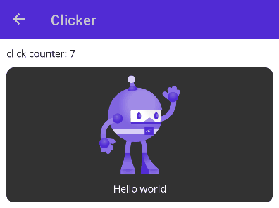
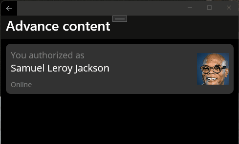

<p align="center">


</p>

[](https://www.nuget.org/packages/ButtonSam.Maui)

# ButtonSam.Maui
The .NET 7.0 library for create easy interactive UI
- **Custom content**
- **Corner radius**
- **Borders**
- **Tap color**
- **Ripple effect for Android**</br>
Implementation ripple effect for API > 21

## Installation
Use extension method `.UseButtonSam()` in static method MauiProgram.CreateMauiApp() 

Example
```
public static class MauiProgram
{
    public static MauiApp CreateMauiApp()
    {
        var builder = MauiApp.CreateBuilder();
        builder
            .UseMauiApp<App>()
            .UseButtonSam()
        ...
    }
}
```

## XAML Sample
```
<?xml version="1.0" encoding="utf-8" ?>
<ContentPage xmlns="http://schemas.microsoft.com/dotnet/2021/maui"
             xmlns:x="http://schemas.microsoft.com/winfx/2009/xaml"
             xmlns:button="clr-namespace:ButtonSam.Maui;assembly=ButtonSam.Maui"
             ...>
    <button:Button TapCommand="{Binding CommandTap}">
        <Label Text="Hello world"
               TextColor="White"/>
    </button:Button>
</ContentPage>
```

## Supported platforms
| Platform | Status |
|-|:-:|
| **WinUI** | ✅ |
| **Android** | ✅ |
| **iOS** | ✅ |
| **MacCatalyst** | ❌ |
| **Tizen** | ❌ |
| **Linux** | ❌ |
